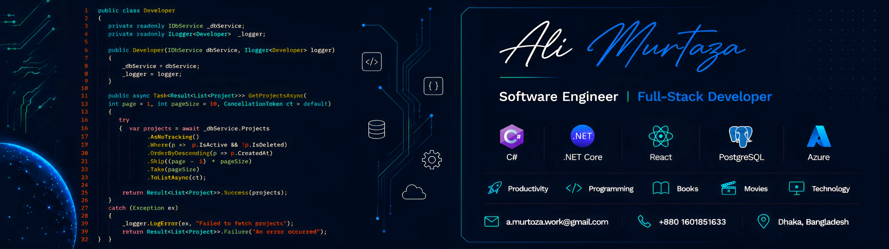
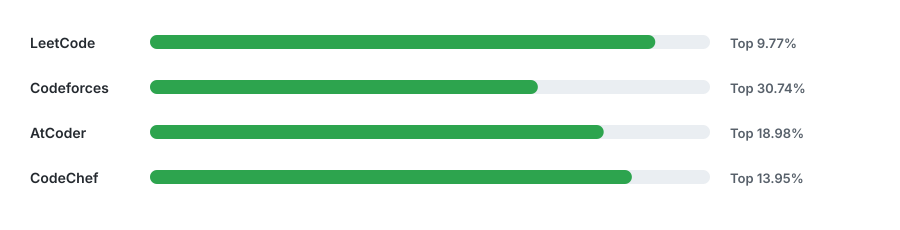

  

<h1 align="left">
  Hi 
  I'm 
</h1>

  

  Building reliable software, exploring Artificial Intelligence, and continuously learning.

---

## 👨‍💻 About Me

- 💼 Full-Stack Software Engineer with **3.5 years** of professional experience
- 🎓 B.Sc. in Computer Science & Engineering, **University of Dhaka**
- 🔬 Passionate about **Software Engineering**, **Artificial Intelligence**, and **Machine Learning**
- 🚀 Interested in scalable backend systems, distributed systems, and modern web development
- 📖 Currently learning **System Design**, **Cloud**, **Docker**, and **Advanced ASP.NET Core**
- 🌱 Always building, always learning

---

## 🚀 Current Focus

- 🔬 Software Defect Prediction Research
- 💻 ASP.NET Core & React
- 🧠 Machine Learning
- ⚙️ System Design
- ☁️ Cloud Technologies
- ✍️ Technical Writing

---

## 🛠️ Tech Stack

### Languages

### Backend

### Frontend

### Database

### DevOps & Tools

---

## 📌 Featured Projects

🔹 Software Structural Defect Prediction

🔹 Protein-Protein Interaction Prediction using CNN

🔹 Full-Stack .NET Applications

🔹 Machine Learning Experiments

---

## 📚 Research & Publications

- 📄 Predicting Protein–Protein Interaction on Domain and Interface Levels using CNN
- 📄 Applications and Limitations of Machine Learning in Radiation Oncology
- 📄 Software Structural Defect Prediction _(Work in Progress)_

---

## 📈 GitHub Stats

---

## 🏆 Competitive Programming

- LeetCode/<a href="https://leetcode.com/u/Ali98Murtoza/">Ali98Murtoza</a> rating: 1718 (Top 12.59%)
- Codeforces/<a href="https://codeforces.com/profile/HydrO7gen/">HydrO7gen</a> rating: 1192 (Top 30.74%)
- AtCoder/<a href="https://atcoder.jp/users/hydrO7gen/">hydrO7gen</a> rating: 823 (Top 18.98%)
- CodeChef/<a href="https://www.codechef.com/users/hydr007gen/">hydr007gen</a> rating: 1464 (Top 13.95%)

Competitive programming stats are automatically visualized and updated via GitHub Actions.

---

## 🌱 Currently Exploring

- Artificial Intelligence
- Machine Learning
- Software Architecture
- Distributed Systems
- Cloud Computing
- Research Methodology

---

## 📫 Connect with Me

  
  &nbsp;
  
  &nbsp;
  

---

### 💡 _"Stay curious. Build thoughtfully. Share what you learn."_

